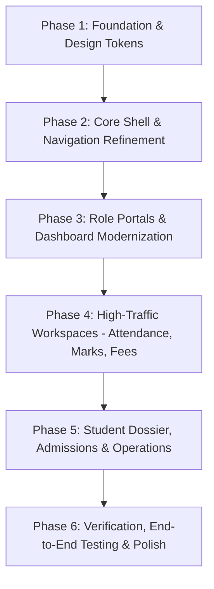

# MySchool-ERP — Complete Frontend UI/UX Audit & Design Specification
**School Institutional System:** Roshani Public School ERP  
**Document Type:** Comprehensive Frontend Technical & UX Audit + Master Redesign Specification  
**Version:** 1.0.0 (Production Master)  
**Date:** August 2026  

---

## Executive Summary

This specification provides an exhaustive, forensic audit of the existing **Roshani Public School ERP (MySchool-ERP)** frontend and outlines the master architectural and design specification for its modern, premium redesign. 

The audit inspects every file, component, layout, route, form, table, data flow, role permission, and verification boundary in the repository. It defines an implementation-ready roadmap that enhances typography, responsiveness, accessibility, component hierarchy, and micro-interactions **without modifying or breaking any backend contracts, Supabase RLS policies, multi-tenant isolation, or financial/academic calculation engines.**

---

# 1. Technology Stack Audit

The table below details the exact technologies, versions, and libraries currently configured in `package.json` and utilized across the codebase:

| Category | Technology / Library | Version | Usage in Project |
| :--- | :--- | :--- | :--- |
| **Framework** | Next.js (App Router) | `16.3.0` | Server Components, Server Actions, Dynamic Routes, API Webhooks |
| **UI Library** | React / React DOM | `19.2.8` | Component rendering, hooks, concurrent features |
| **Language** | TypeScript | `^5.0.0` | Strict type checking (`tsconfig.json`), full domain models |
| **CSS Engine** | Tailwind CSS (PostCSS) | `^4.0.0` | `@import "tailwindcss"`, CSS variables, custom theme extensions |
| **Icon Library** | Lucide React | `^1.31.0` | Institutional icons across sidebar, metric cards, status badges |
| **Form Handling** | React Hook Form | `^7.85.0` | High-performance uncontrolled form state management |
| **Validation** | Zod + Hookform Resolvers | `^4.4.3` / `^5.7.1` | Schema validation for admissions, students, fees, and marks |
| **Backend & DB** | Supabase JS + SSR | `^2.112.3` / `^0.12.4` | Cookie-based session resolution, Supabase PostgreSQL, RLS |
| **Testing (Unit)**| Vitest | `^4.1.10` | Fast unit & integration tests |
| **Testing (E2E)** | Playwright | `^1.62.1` | Cross-browser end-to-end integration and smoke tests |
| **Script Runner** | TSX | `^4.23.12` | Database seed scripts & test user provisioners |
| **Theme System** | Vanilla CSS custom properties | Native | Institutional navy, gold, berry, slate, status tokens in `globals.css` |
| **Data Fetching** | Server Actions & Async RSC | Next 16 RSC | Direct server-to-database queries with zero client waterfall |

---

# 2. Complete Route Inventory

The ERP frontend utilizes Next.js App Router grouped into authentication, core ERP portals, public verification, and webhook endpoints:

| Route Path | Module | Target Roles | Page Purpose | Data Source | Main Actions & Capabilities |
| :--- | :--- | :--- | :--- | :--- | :--- |
| `/` | Landing / Redirect | Public / All | Root entry redirecting authenticated users to role portal or `/login` | `resolveUser()` | Automatic role routing |
| `/(auth)/login` | Auth | Public | Unified institutional email/password sign-in | Supabase Auth API | Sign in, redirect to ERP portal |
| `/(auth)/forgot-password` | Auth | Public | Password recovery request | Supabase Auth API | Send recovery email |
| `/(auth)/reset-password` | Auth | Public | New password definition via recovery token | Supabase Auth API | Update password |
| `/erp` | Portal Router | All Authenticated | Central dispatching hub routing users to their active portal | `resolveUser()` | Dynamic routing by active role |
| `/erp/select-role` | Auth / Multi-Role | Multi-Role Users | Interactive switcher for accounts with multiple assigned roles | User profile roles | Switch active role context |
| `/erp/unauthorized` | System Error | Authenticated | Fallback screen when user lacks RBAC permissions for a route | Static | Return to safe role portal |
| `/erp/account-not-provisioned` | System Error | Authenticated | State displayed when user has auth credentials but no profile in school | `resolveUser()` | Guidance to contact Admin |
| `/erp/admin` | Dashboard | Super Admin, Admin | Executive administrative command center & operational overview | Supabase DB queries | View KPIs, jump to daily workflows |
| `/erp/admin/students` | Students | Super Admin, Admin | Comprehensive student directory with multi-facet filters & pagination | `getStudents()` | Search, filter by class/session/status, open profiles |
| `/erp/admin/students/new` | Students | Super Admin, Admin | Direct student admission & profile enrollment form | `getAcademicSessions()`, `getClasses()` | Enroll student, assign class/section |
| `/erp/admin/students/[id]` | Students | Super Admin, Admin | Comprehensive student dossier (Overview, Academics, Guardians, Docs) | `getStudentById()` | View history, link guardians, change status |
| `/erp/admin/students/[id]/edit` | Students | Super Admin, Admin | Edit existing student personal & demographic details | `getStudentById()` | Update student records |
| `/erp/admin/admissions` | Admissions | Super Admin, Admin, Principal | Admissions pipeline, application review, status lifecycle | `getAdmissionApplications()` | Review applications, convert to student |
| `/erp/admin/admissions/new` | Admissions | Super Admin, Admin | Register new enquiry or student admission application | Classes, Sessions | Submit candidate dossier |
| `/erp/admin/admissions/[id]` | Admissions | Super Admin, Admin | Detailed application view with guardian info & status conversion | `getAdmissionApplicationById()` | Approve, reject, or convert to student |
| `/erp/admin/attendance` | Attendance | Super Admin, Admin | School-wide attendance overview & daily register management | `getAttendanceDashboardData()` | Check class attendance rates, open sheets |
| `/erp/admin/fees` | Fees | Super Admin, Admin | Fee heads, fee structures, student ledger & fee billing | `getFeeDashboardSummary()` | Manage fee heads, assign class fee templates |
| `/erp/admin/collections` | Fees | Super Admin, Admin | Daily collection register, cash reconciliation & receipt issuance | `getCollectionRegister()` | Cash/UPI counter receipt generation |
| `/erp/admin/examinations` | Examinations | Super Admin, Admin | Exam terms setup, subject configurations, date schedules | `getExaminations()` | Create terms, schedule exams, set pass marks |
| `/erp/admin/admit-cards` | Examinations | Super Admin, Admin | Batch admit card generation with QR verification tokens | `getAdmitCardsData()` | Generate admit cards, check fee holds |
| `/erp/admin/results` | Examinations | Super Admin, Admin | Marks tabulation, term calculation, grade card publishing | `getExaminations()`, `getClasses()` | Calculate results, publish report cards |
| `/erp/admin/promotion` | Academics | Super Admin, Admin | End-of-year academic promotion and retention workspace | `getPromotionCandidates()` | Bulk promote students to next class |
| `/erp/admin/teacher-assignments` | Operations | Super Admin, Admin | Assign class teachers & subject teachers to sections | `getTeacherAssignments()` | Allocate faculty to classes/subjects |
| `/erp/admin/leave` | Operations | Super Admin, Admin | Staff & student leave application tracking and policies | `getUserLeaveApplications()` | View leave status |
| `/erp/admin/leave/approvals` | Operations | Super Admin, Admin | Executive leave approval queue with instant approve/reject | `getPendingApprovalsQueue()` | Clear pending leaves with remarks |
| `/erp/admin/documents` | Operations | Super Admin, Admin | Institutional certificates (TC, Bonafide, Character) generator | `getDocumentsData()` | Issue signed certificates with QR |
| `/erp/admin/settings` | Settings | Super Admin, Admin | Settings overview & institutional configuration navigation | `getSchoolProfile()` | Overview of school configurations |
| `/erp/admin/settings/school` | Settings | Super Admin, Admin | School profile, UDISE code, affiliation, addresses & branding | `getSchoolProfile()` | Update school identity & details |
| `/erp/admin/settings/modules` | Settings | Super Admin, Admin | Feature registry & optional subsystem toggles (Library, Transport, etc.) | `getSchoolFeatures()` | Enable/disable modular features |
| `/erp/admin/settings/required-fields` | Settings | Super Admin, Admin | Tier-3 configurable field validation rules per entity | `getFieldConfigs()` | Set mandatory/optional form fields |
| `/erp/principal` | Dashboard | Principal, Vice Principal | Executive leadership cockpit & academic oversight | Supabase DB queries | High-level metrics, review approvals |
| `/erp/principal/admissions` | Admissions | Principal | Admissions pipeline review & academic clearance | `getAdmissionApplications()` | Review applications |
| `/erp/principal/students` | Students | Principal | Student directory & enrollment status tracking | `getStudents()` | View student records |
| `/erp/principal/attendance` | Attendance | Principal | Institutional attendance rates & trend monitoring | Supabase attendance queries | Monitor daily presence trends |
| `/erp/principal/examinations` | Examinations | Principal | Academic assessment scheduling & term planning | `getExaminations()` | Oversee terms |
| `/erp/principal/admit-cards` | Examinations | Principal | Hall ticket authorization & release validation | Supabase queries | Verify admit cards |
| `/erp/principal/results` | Examinations | Principal | Term result review, grade distribution & approval | `getResultsData()` | Approve and publish school results |
| `/erp/principal/promotion` | Academics | Principal | Year-end progression authorization | Supabase queries | Authorize class progression |
| `/erp/principal/leave` | Operations | Principal | Staff & faculty leave clearance queue | `getPendingApprovalsQueue()` | Executive leave approval |
| `/erp/principal/documents` | Operations | Principal | Certificate issuance review | Supabase queries | Review issued student certificates |
| `/erp/accountant` | Dashboard | Accountant | Accounts & finance office command center | `getFeeDashboardSummary()` | Monitor daily cash collections & balances |
| `/erp/accountant/fees` | Fees | Accountant | Student fee ledger & billing overview | `getInvoices()`, `getPayments()` | View outstanding invoices |
| `/erp/accountant/collections` | Fees | Accountant | Real-time counter receipt collection & daily cash balancing | `getCollectionRegister()` | Issue counter receipts, daily cash audit |
| `/erp/teacher` | Dashboard | Teacher, Class Teacher | Classroom operations cockpit & daily desk | `getTeacherAssignments()` | Quick links to today's registers |
| `/erp/teacher/attendance` | Attendance | Teacher, Class Teacher | Class section attendance registers | `getTeacherAssignments()` | Select class section to mark register |
| `/erp/teacher/attendance/mark` | Attendance | Teacher, Class Teacher | Fast single-tap attendance marking sheet with instant status tallies | `getAttendanceSheetData()` | Mark Present/Absent/Late/Leave, save |
| `/erp/teacher/marks` | Examinations | Teacher, Class Teacher | Subject marks spreadsheet (Theory, Practical, Internal) | `getMarksSheetData()` | Enter scores, save draft, submit marks |
| `/erp/teacher/examinations` | Examinations | Teacher | Invigilation duties & exam schedule timetable | `getTeacherExamSchedule()` | View exam duties & hall assignments |
| `/erp/teacher/leave` | Operations | Teacher | Faculty leave application & status portal | `getUserLeaveApplications()` | Submit casual/medical leave with proof |
| `/erp/student` | Dashboard | Student | Student personal academic home & institutional desk | Student profile queries | View attendance donut, fees, results |
| `/erp/student/attendance` | Attendance | Student | Self attendance percentage, calendar log & monthly breakdown | `getStudentSelfAttendance()` | View personal attendance record |
| `/erp/student/results` | Examinations | Student | Academic performance analytics, grade progression & report cards | `getStudentResults()` | View term marks, comparison, print card |
| `/erp/student/promotion` | Academics | Student | Promotion status & current academic standing | Supabase queries | View progression record |
| `/erp/student/admit-cards` | Examinations | Student | Digital exam hall ticket with secure verification QR | `getStudentAdmitCard()` | Download / Print admit card |
| `/erp/student/fees` | Fees | Student | Fee structure, paid receipts & outstanding balance summary | `getInvoices()`, `getPayments()` | View dues & download payment receipts |
| `/erp/student/leave` | Operations | Student | Student leave application submission & tracking | `getUserLeaveApplications()` | Apply for leave to class teacher |
| `/erp/student/documents` | Operations | Student | Official digital document center (TC, Bonafide, Result Cards) | `getStudentDocuments()` | Download certified documents |
| `/erp/parent` | Dashboard | Parent | Family multi-ward dashboard & unified child selector | `getParentAttendanceData()` | Switch between wards, track child stats |
| `/erp/parent/attendance` | Attendance | Parent | Child attendance records & monthly presence breakdown | `getParentAttendanceData()` | Monitor child daily attendance |
| `/erp/parent/results` | Examinations | Parent | Child term report cards, subject scores & teacher remarks | `getStudentResults()` | View child progress cards |
| `/erp/parent/promotion` | Academics | Parent | Child year-end progression details | Supabase queries | Verify promotion status |
| `/erp/parent/admit-cards` | Examinations | Parent | Child examination admit card & venue details | `getStudentAdmitCard()` | Print hall ticket for exam |
| `/erp/parent/fees` | Fees | Parent | Child fee ledger, online Razorpay gateway payment & receipts | `getParentFeeData()` | Pay fees online, download receipts |
| `/erp/parent/leave` | Operations | Parent | Submit parent-authorized leave requests for children | `getUserLeaveApplications()` | Request leave for ward |
| `/erp/parent/documents` | Operations | Parent | Certified certificates & official school records for ward | `getStudentDocuments()` | Download ward certificates |
| `/verify/admit-card/[token]` | Public Verification | Public | HMAC token verification for examination admit cards | `verifyAdmitCardToken()` | Public authenticity confirmation |
| `/verify/certificate/[token]` | Public Verification | Public | HMAC token verification for school certificates (TC/Bonafide) | `verifyCertificateToken()` | Public authenticity confirmation |
| `/verify/report-card/[token]` | Public Verification | Public | HMAC token verification for published student report cards | `verifyReportCardToken()` | Public authenticity confirmation |
| `/api/webhooks/razorpay` | API Webhook | Server / Razorpay | Webhook handler for online fee payment reconciliation | Razorpay signature verification | Reconcile invoices & ledger |

---

# 3. Information Architecture

The actual Information Architecture of the MySchool-ERP system structured by domain:

```text
Roshani Public School ERP
│
├── 1. Authentication & Security
│   ├── Unified Login (/login)
│   ├── Password Reset (/forgot-password, /reset-password)
│   ├── Multi-Role Role Switcher (/erp/select-role)
│   └── Multi-Tab Real-time Session Sync
│
├── 2. Role-Dedicated Command Portals
│   ├── Admin Portal (/erp/admin)
│   ├── Principal Portal (/erp/principal)
│   ├── Teacher Cockpit (/erp/teacher)
│   ├── Accounts & Finance Portal (/erp/accountant)
│   ├── Parent Portal (/erp/parent)
│   └── Student Desk (/erp/student)
│
├── 3. Student Lifecycle & Admissions
│   ├── Admissions Pipeline (/erp/admin/admissions)
│   │   ├── New Enquiry / Application (/erp/admin/admissions/new)
│   │   └── Application Review & Conversion (/erp/admin/admissions/[id])
│   ├── Student Directory (/erp/admin/students)
│   │   ├── Direct Student Enrollment (/erp/admin/students/new)
│   │   └── Comprehensive Student Dossier (/erp/admin/students/[id])
│   │   └── Edit Student Profile (/erp/admin/students/[id]/edit)
│   └── Promotion & Class Progression (/erp/admin/promotion)
│
├── 4. Academic Architecture & Operations
│   ├── Academic Sessions Management
│   ├── Class & Section Management
│   ├── Subject Catalog
│   └── Faculty Assignments (/erp/admin/teacher-assignments)
│
├── 5. Attendance Management
│   ├── Admin Institutional Attendance Dashboard (/erp/admin/attendance)
│   ├── Teacher Classroom Attendance Desk (/erp/teacher/attendance)
│   │   └── Fast Single-Tap Register Marking Sheet (/erp/teacher/attendance/mark)
│   ├── Parent Ward Attendance Tracking (/erp/parent/attendance)
│   └── Student Self Attendance Log (/erp/student/attendance)
│
├── 6. Examination, Marks & Tabulation
│   ├── Exam Master & Term Schedules (/erp/admin/examinations)
│   ├── Teacher Marks Entry Spreadsheet (/erp/teacher/marks)
│   │   ├── Boundary Validation & Auto-Totals
│   │   ├── Post-Submission Mark Correction Audit
│   │   └── Administrative Lock / Unlock
│   ├── Results Tabulation & Publication (/erp/admin/results)
│   │   ├── Result Calculation & Pass/Fail Determination
│   │   ├── Financial Clearance Overrides
│   │   └── Official Grade Card Document
│   └── Admit Cards Center (/erp/admin/admit-cards)
│       └── QR-Verified Hall Tickets (/erp/student/admit-cards, /erp/parent/admit-cards)
│
├── 7. Fee & Financial Management
│   ├── Fee Structure Setup & Heads (/erp/admin/fees)
│   ├── Fee Counter & Daily Cash Register (/erp/admin/collections, /erp/accountant/collections)
│   ├── Cash Balancing & Reconciliation
│   └── Parent Online Payment Gateway & Receipts (/erp/parent/fees)
│
├── 8. Institutional Services & Governance
│   ├── Leave Management & Approval Queue (/erp/admin/leave, /erp/principal/leave)
│   ├── Official Document & Certificate Generation (/erp/admin/documents)
│   └── School Settings & Governance (/erp/admin/settings)
│       ├── School Profile & UDISE Affiliation (/erp/admin/settings/school)
│       ├── Feature & Module Registry (/erp/admin/settings/modules)
│       └── Custom Configurable Field Rules (/erp/admin/settings/required-fields)
│
└── 9. Public Tamper-Proof Verification Engine
    ├── Admit Card Token Verification (/verify/admit-card/[token])
    ├── Certificate Token Verification (/verify/certificate/[token])
    └── Report Card Token Verification (/verify/report-card/[token])
```

---

# 4. Global Layout Audit

### 4.1 Sidebar (`src/components/layout/erp-sidebar.tsx`)
* **Width:** Expanded desktop width is `270px` (`w-[270px]`), Collapsed desktop width is `80px` (`w-20`), Mobile drawer width is `280px` (`w-[280px]`).
* **Visual Theme:** Deep institutional navy background (`#031B3A`), border separator (`#0F2440`), text in high-contrast crisp slate (`text-slate-300`, active `text-white`).
* **Brand Header:** Embedded `SchoolLogo` (44px crisp square, rounded-xl, shadow-md, ring-1 ring-white/20) paired with institutional school title "Roshani Public School" and role badge pill.
* **Role Pill Indicator:** Dynamic pill styling per role based on `ROLE_PORTAL_MAP` (e.g. Admin: Cyan pill `bg-cyan-500/15 text-cyan-400 border-cyan-500/30`, Teacher: Sky pill, Parent: Indigo pill, Student: Emerald pill, Principal: Purple pill).
* **Navigation Sections:** Section titles rendered in uppercase `text-[9.5px] font-mono tracking-widest text-slate-400/90`.
* **Active State:** Solid royal blue `#1554C0` background with vertical accent indicator bar on left border (`brand.indicatorClass`).
* **Interaction:** Smooth 300ms transition, hover feedback `#0F2440`, collapsed state tooltips, collapsible toggle arrow button.
* **Mobile Behavior:** Off-canvas drawer sliding in from left (`-translate-x-full lg:translate-x-0`), backdrop overlay with blur `bg-slate-950/75 backdrop-blur-xs`, body scroll lock, dismiss on Escape key and route transition.

### 4.2 Header (`src/components/layout/erp-header.tsx`)
* **Dimensions:** Height `68px` (`h-17`), sticky header with `bg-white/95 backdrop-blur-xs`, bottom border `border-slate-200/90`, shadow `shadow-2xs`.
* **Left Segment:** Mobile hamburger menu trigger button, mobile school logo and role badge, desktop academic session pill (`Academic Session: 2024–2025` with calendar icon).
* **Right Segment:** 
  * Interactive `NotificationBell` with live unread badge and dropdown menu.
  * Multi-role "Switch Role" button if user holds >1 role (`/erp/select-role`).
  * User profile avatar pill with capitalized initial, user full name, and role badge.
  * `LogoutButton` for secure session termination.

### 4.3 Main Content Shell (`src/components/layout/erp-app-shell.tsx`)
* **Background:** Light clean surface `bg-slate-50`.
* **Padding:** Responsive padding `p-4 sm:p-6 lg:p-8`.
* **Max Width:** Centered container constrained to `max-w-7xl w-full mx-auto`.
* **Real-time Synchronization:** Embedded `<MultiTabAuthSync />` listener to instantly handle multi-tab sign-outs or session invalidation.

---

# 5. Design System Audit (Current Tokens)

The existing styling in `src/app/globals.css` implements institutional color tokens:

```css
:root {
  /* Institutional Brand Palette */
  --brand-navy-dark: #031b3a;
  --brand-navy-surface: #0f2440;
  --brand-navy-border: #1e3a60;
  --brand-blue-primary: #1554c0;
  --brand-blue-hover: #0f44a3;
  --brand-blue-light: #eff6ff;
  --brand-berry-accent: #b91c5c;
  --brand-berry-hover: #9e144c;
  --brand-gold-accent: #f4c542;
  --brand-gold-hover: #e0b030;

  /* Surfaces & Neutrals */
  --background: #f8fafc;
  --foreground: #0f172a;
  --surface-page: #f8fafc;
  --surface-card: #ffffff;
  --surface-muted: #f1f5f9;
  --surface-elevated: #ffffff;

  /* Borders */
  --border-subtle: #e2e8f0;
  --border-strong: #cbd5e1;
  --border-focus: #1554c0;

  /* Status Colors */
  --status-success-bg: #ecfdf5;
  --status-success-text: #047857;
  --status-success-border: #a7f3d0;
  --status-warning-bg: #fffbeb;
  --status-warning-text: #b45309;
  --status-warning-border: #fde68a;
  --status-danger-bg: #fff1f2;
  --status-danger-text: #be123c;
  --status-danger-border: #fecdd3;
  --status-info-bg: #eff6ff;
  --status-info-text: #1d4ed8;
  --status-info-border: #bfdbfe;

  /* Radius Scale */
  --radius-sm: 6px;
  --radius-md: 8px;
  --radius-lg: 12px;
  --radius-xl: 16px;
  --radius-2xl: 24px;
  --radius-full: 9999px;

  /* Layout Constants */
  --sidebar-width: 270px;
  --sidebar-collapsed-width: 80px;
  --header-height: 68px;
  --max-content-width: 1280px;
}
```

---

# 6. Reusable Component Inventory

The codebase contains 13 core UI primitives and 40+ module-level composite components:

| Component Name | File Location | Purpose & Capabilities | Key Props & Variants |
| :--- | :--- | :--- | :--- |
| `Button` | `src/components/ui/button.tsx` | Standard action button with loading spinners, icon slots, and active states | `variant`: `primary`, `secondary`, `destructive`, `ghost`, `outline`, `success`, `link`; `size`: `sm`, `md`, `lg`; `isLoading`, `loadingText`, `leftIcon`, `rightIcon` |
| `Input` | `src/components/ui/input.tsx` | Form text input with floating/stacked label, helper text, and error validation states | `label`, `error`, `helperText`, `leftIcon`, `rightIcon`, standard HTML input props |
| `DataTable` | `src/components/ui/data-table.tsx` | Client-side searchable, sortable, paginated data grid with empty & loading states | `data`, `columns`, `keyExtractor`, `searchable`, `searchKeys`, `pageSize`, `isLoading`, `emptyTitle`, `filterControls` |
| `StatusBadge` | `src/components/ui/status-badge.tsx` | Standardized status pill with colored pulse dot supporting 30+ domain statuses | `status`: `active`, `approved`, `present`, `paid`, `published`, `pending`, `absent`, `overdue`, etc.; `size`: `sm`, `md`, `lg`; `dot` |
| `MetricCard` | `src/components/ui/metric-card.tsx` | KPI statistical card with icon container, subtitle, trend badge, and optional link | `title`, `value`, `subtitle`, `icon`, `iconColor` (`blue`, `emerald`, `amber`, `purple`, `rose`), `href`, `trend` |
| `PageHeader` | `src/components/ui/page-header.tsx` | Standardized view header with uppercase eyebrow, title, description, breadcrumbs, and actions | `title`, `eyebrow`, `description`, `breadcrumbs` array, `actions` slot |
| `Modal` | `src/components/ui/modal.tsx` | Accessible dialog modal with backdrop blur, focus trapping, Escape key dismiss, and title | `isOpen`, `onClose`, `title`, `description`, `size` (`sm`, `md`, `lg`, `xl`, `full`), `children` |
| `ConfirmDialog` | `src/components/ui/confirm-dialog.tsx` | Destructive action confirmation dialog with confirm/cancel buttons | `isOpen`, `title`, `message`, `confirmText`, `cancelText`, `onConfirm`, `onCancel`, `variant` |
| `EmptyState` | `src/components/ui/empty-state.tsx` | Contextual zero-data illustration container with action CTA | `icon`, `title`, `description`, `actionLabel`, `onAction`, `actionHref` |
| `Skeleton` | `src/components/ui/skeleton.tsx` | Animated pulse placeholders including `SkeletonCard`, `SkeletonTable`, `SkeletonForm` | `rows`, `cols`, `className` |
| `LockedField` | `src/components/ui/locked-field.tsx` | Read-only input lock indicator for immutable or system-managed entity properties | `label`, `value`, `reason`, `icon` |
| `QrCode` | `src/components/ui/qr-code.tsx` | SVG-based QR code generator for document and admit card authenticity verification | `value`, `size`, `className`, `level` |
| `SchoolLogo` | `src/components/ui/school-logo.tsx` | Official institutional insignia component with Next.js image optimization | `className`, `priority` |
| `NotificationBell` | `src/components/layout/notification-bell.tsx` | Interactive header notifications bell with live unread counter badge and dropdown | `initialNotifications`, `initialUnreadCount` |
| `ERPSidebar` | `src/components/layout/erp-sidebar.tsx` | Responsive role-based multi-section navigation sidebar | `userRole`, `allRoles`, `userName`, `schoolId`, `isCollapsed`, `isMobileOpen` |
| `ERPHeader` | `src/components/layout/erp-header.tsx` | Top application bar with user status, session info, role switcher, and logout | `userName`, `roles`, `activeRole`, `notifications`, `unreadCount` |

---

# 7. Dashboard Audits by Role

### 7.1 Admin Command Center (`/erp/admin`)
* **Target Audience:** Super Admin, Administrator
* **Header & Greetings:** "Administrative Command Center" eyebrow with "Welcome back, {User Name}" and direct action buttons (+ Add Student, + New Application).
* **Summary KPI Cards:**
  1. *Active Students:* Total active students enrolled across school classes (`getStudents`).
  2. *Admission Applications:* Total enquiries and applications logged for active session (`getAdmissionApplications`).
  3. *Pending Approvals:* Count of unapproved staff/student leave requests (`getPendingApprovalsQueue`).
  4. *Scheduled Exams:* Active assessment terms in progress (`getExaminations`).
* **Direct Shortcuts Ribbon:** 6 quick single-tap action cards (Attendance, Collect Fees, Admit Cards, Publish Results, Issue Certificate, Promotion).
* **Two-Column Split Workspace:**
  * *Left:* Recent Admission Applications (application number, candidate name, class, guardian, review CTA).
  * *Right:* Recently Enrolled Students (student avatar, admission number, full name, status, profile link).

### 7.2 Principal Leadership Cockpit (`/erp/principal`)
* **Target Audience:** Principal, Vice Principal, Head of School
* **Header:** "Executive Leadership & Oversight" with high-level institutional summary.
* **Summary KPI Cards:**
  1. *Total Student Body:* Enrolled students distributed across class divisions.
  2. *Enrolment Pipeline:* Total admissions logged in session.
  3. *Executive Approvals:* Urgent pending leaves requiring clearance.
  4. *Academic Terms:* Active examination cycles.
* **Workspaces:** Direct leave approval queue with instant action modal and class-by-class student distribution breakdown.

### 7.3 Teacher Daily Cockpit (`/erp/teacher`)
* **Target Audience:** Subject Teachers, Class Teachers
* **Header:** "Classroom Operations & Teacher Desk" with prominent "+ Mark Today's Attendance" CTA.
* **Summary KPI Cards:** Assigned Classes count, Today's Register status, Scheduled Invigilation Duties, Leave History.
* **Quick Attendance Strip:** Visual cards for each assigned class section with direct "Mark Today" button launching the single-tap attendance sheet.
* **Workspaces:** Rapid jump to Subject Marks Submission Spreadsheet and Teacher Leave Portal.

### 7.4 Finance & Accounts Dashboard (`/erp/accountant`)
* **Target Audience:** Accountant, Cashier, Finance Officer
* **Header:** "Accounts & Finance Counter" with "+ Collect Fee at Counter" CTA.
* **Summary KPI Cards:**
  1. *Today's Collection:* Total rupee amount collected across all payment channels today (`getDailyReconciliation`).
  2. *Total Fees Collected:* Gross revenue collected for active session (`getFeeDashboardSummary`).
  3. *Pending Dues:* Unpaid / partial student balances across school.
  4. *Recent Transactions:* Count of receipts processed in billing month.
* **Workspaces:**
  * *Left:* Payment Channel Breakdown (Cash vs. UPI vs. Bank Transfer vs. Cheque vs. POS).
  * *Right:* Recent Counter Receipts register with instant status badges and student details.

### 7.5 Student Academic Home (`/erp/student`)
* **Target Audience:** Enrolled Students
* **Header:** Personalized greeting, student photo/avatar, admission number, current academic session.
* **Summary Hero Section:** Circular Attendance rate donut gauge, latest upcoming examination term, digital admit card status, academic percentage & grade.
* **Quick Actions:** Horizontal shortcuts (View Attendance, Exam Hall Ticket, Term Results, Fee Dues & Receipts, Apply Leave, Documents).
* **Information Grid:**
  * Attendance Overview & Absence Log.
  * Latest Institutional Notices & Announcements.
  * Academic Calendar & Upcoming Deadlines.
  * Subject Performance breakdown.
  * Fee billing & payment summary card.
  * Digital Document download center.

### 7.6 Parent Multi-Ward Portal (`/erp/parent`)
* **Target Audience:** Parents & Legal Guardians
* **Header:** "Family & Guardian Portal" with multi-ward child switcher strip.
* **Multi-Ward Switcher:** Interactive child selection cards allowing instant toggle between siblings/children enrolled in the school.
* **Summary KPI Cards for Selected Child:** Attendance rate percentage, Fee status & dues, Admit card readiness, Published report cards.
* **Quick Action Ribbon:** Attendance, Fees & Pay, Admit Card, Report Cards, Certificates, Request Leave.
* **Feature Cards:** Online Fee Payments (Razorpay integration) & Academic Report Cards.

---

# 8. Student Module UI Audit

### 8.1 Student Directory (`/erp/admin/students`)
* **Layout:** Full-width container with responsive filter toolbar and tabular list.
* **Filters:** Search text (Admission #, Name, Phone), Status dropdown (All, Active, Inactive, Alumni, Transferred, Withdrawn), Session selector, Class selector, Gender filter.
* **Table Columns:** Admission #, Student Name & Avatar, Class & Section, Roll #, Primary Guardian Name & Phone, Status Badge, Action (Profile &rarr;).
* **Mobile Behavior:** Horizontal scrolling table with persistent padding and legible touch targets.

### 8.2 Direct Student Enrollment Form (`/erp/admin/students/new`)
* **Layout:** Multi-section institutional form.
* **Sections:**
  1. *Academic Placement:* Session, Class, Section, Roll Number.
  2. *Personal Details:* Admission Number, First Name, Middle Name, Last Name, Date of Birth, Gender, Blood Group, Category.
  3. *Contact & Address:* Phone, Email, Street Address, City, State, Pin Code.
  4. *Primary Guardian:* Guardian Name, Relationship (Father/Mother/Guardian), Phone, Email, Address.
* **Validation:** Powered by Zod schema with instant field validation error indicators.

### 8.3 Student Comprehensive Dossier (`/erp/admin/students/[id]`)
* **Header Dossier Card:** Student Photo / Initials avatar, Admission Number badge, Status badge, Full Name, Active Class & Section, Quick Action buttons (Change Status Modal, Edit Profile).
* **Tabbed Interface:**
  1. **Overview & Profile Details:** Personal Information (DOB, Gender, Phone, Email) and Address Information (Street, City, State).
  2. **Academic History Log:** Chronological record of all past sessions, classes, sections, roll numbers, and academic statuses.
  3. **Guardians:** Card grid of associated parents/guardians with primary designation, relationship, phone, email, address, and unlink action. Includes "+ Add / Link Guardian" modal.
  4. **Documents:** Official student documents uploaded (TC, Birth Certificate, Aadhar, Previous Marks) with upload date and download link.

---

# 9. Attendance Module UI Audit

### 9.1 Fast Single-Tap Attendance Marking Sheet (`/erp/teacher/attendance/mark`)
* **Header:** Class Name, Section, Attendance Session Status (`draft`, `submitted`, `locked`), Attendance Date, Enrolled Count, "Mark All Present" shortcut.
* **Real-time Live Counters:** 4 metric cards dynamically updating as teacher taps statuses (Present - Emerald, Absent - Rose, Late - Amber, On Leave - Sky).
* **Attendance Table:**
  * Columns: Roll #, Admission No, Student Name, Status Button Group, Optional Remarks.
  * Status Selector: 4-way single-tap button group (Present, Absent, Late, Leave).
* **Submitted Session Governance:**
  * Once submitted, modifying the sheet enforces a **Mandatory Correction Reason input** (min 3 characters) to maintain an audit trail.
  * When locked by administrator, all inputs become disabled.

### 9.2 Institutional Attendance Dashboard (`/erp/admin/attendance`)
* **Summary Cards:** Total Enrolled Students, Present Today count, Absent Today count, School-wide Attendance Percentage.
* **Class-by-Class Register Status Grid:** Lists every class and section with marked status (`Marked`, `Pending`, `Submitted`), recorded presence rate, and direct link to open the marking sheet.

---

# 10. Examination & Marks Module UI Audit

### 10.1 Standardized Examination Terminology
In strict accordance with the institution's official terminology standards:
* **Unit Test** (UT 1, UT 2)
* **Periodic Test** (PT 1, PT 2)
* **Half-Yearly Examination** (Term 1 Summative)
* **Yearly Examination / Annual Examination** (Term 2 Final)
*(Note: "Semester Examination" is deprecated and not utilized).*

### 10.2 Exam Master & Schedules (`/erp/admin/examinations`)
* **Term Setup:** Create examination cycles with Session binding, Exam Type, Name, Code, Start Date, End Date.
* **Subject Configuration:** Set Theory Max Marks, Practical Max Marks, Internal Max Marks, and Passing Marks threshold per class subject.
* **Schedule Manager:** Allocate Exam Date, Start Time, End Time, Venue/Room, and Invigilator staff. Features conflict detection for classroom and teacher overlaps.

### 10.3 Subject Marks Entry Spreadsheet (`/erp/teacher/marks`)
* **Filters:** Examination selector, Class selector, Subject selector.
* **Spreadsheet Grid:**
  * Columns: Student Name, Admission No, Attendance Status (Present / Absent / Excused / Not Appeared), Theory Marks input, Practical Marks input, Internal Marks input, Auto-calculated Total Marks, Workflow Status badge.
  * **Auto-Zero on Absence:** When marked "Absent", numeric mark inputs auto-reset to 0 and disable.
  * **Boundary Validation:** Inputs enforce `0 <= marks <= maximumMarks`.
* **Actions:**
  * *Save Draft Marks:* Saves incomplete marks without locking.
  * *Submit Class Marks:* Moves workflow status to `submitted`.
  * *Post-Submission Correction Modal:* Enables authorized teachers/admins to correct a mark post-submission by providing an audit justification.
  * *Administrative Lock / Unlock:* Super Admin/Principal action to freeze or reopen marks.

### 10.4 Results Tabulation & Publication (`/erp/admin/results`)
* **Calculation Engine:** Computes Total Marks Obtained, Maximum Marks, Aggregate Percentage, Division/Grade, and Pass/Fail/Compartment status.
* **Financial Clearance Check:** Identifies students with outstanding fee arrears. Allows administrative override with mandatory reason logging.
* **Publication Lifecycle:** `draft` &rarr; `calculated` &rarr; `pending_approval` &rarr; `approved` &rarr; `published`.

### 10.5 QR-Verified Admit Cards & Certificates (`/erp/admin/admit-cards`, `/erp/admin/documents`)
* **Admit Card Document:** Institutional header, student photo, candidate details, class, roll number, examination timetable table, candidate instructions, Principal signature, and cryptographically signed QR Code linking to `/verify/admit-card/[token]`.
* **Official Certificates:** Transfer Certificate (TC), Bonafide Certificate, Character Certificate with official seal and QR verification.

---

# 11. Fees & Financial Management UI Audit

### 11.1 Fee Dashboard & Structures (`/erp/admin/fees`)
* **Financial Summary Cards:** Total Billed, Total Collected, Total Outstanding Dues, Today's Counter Collection.
* **Fee Structure Manager:** Define class-wise fee schedules composed of modular Fee Heads (Tuition Fee, Admission Fee, Exam Fee, Transport Fee, Computer Lab Fee) with frequencies (Monthly, Quarterly, Annual, One-time).

### 11.2 Real-time Fee Collection Register (`/erp/admin/collections`, `/erp/accountant/collections`)
* **Counter Receipt Workspace:** Search student by Admission # or Name &rarr; loads outstanding invoices &rarr; enter payment amount &rarr; select payment mode (Cash, UPI, Bank Transfer, Cheque, POS) &rarr; record transaction reference &rarr; generate instant printable 3-copy receipt (Student Copy, Accounts Copy, Office Copy).
* **Daily Cash Reconciliation:** End-of-day cash drawer balancing (Opening Cash + Cash Collected - Refunds = Expected Physical Cash). Records physical cash counted, variance difference, and cashier sign-off.

---

# 12. Settings & Feature Governance UI Audit

### 12.1 Settings Hub (`/erp/admin/settings`)
* **School Profile & Branding (`/erp/admin/settings/school`):** UDISE 11-digit code, CBSE/State Board affiliation number, School Legal Name, Tagline/Motto, Contact Email, Phone Numbers, Physical Campus Address, Official Stamp/Seal upload.
* **Feature Registry (`/erp/admin/settings/modules`):** Dynamic feature flag toggle matrix for optional subsystems (Transport, Hostel, Library, Inventory, Payroll, House System, Clubs). Automatically performs dependency checks before disabling.
* **Configurable Field Rules (`/erp/admin/settings/required-fields`):** Tier-3 governance enabling administrators to configure required vs. optional field validation rules across Student, Guardian, Staff, and Admission entities without code changes.

---

# 13. Public Tamper-Proof Verification UI Audit

* **Admit Card Verification (`/verify/admit-card/[token]`):** Displays verified student details, examination name, issue timestamp, and official validity confirmation.
* **Certificate Verification (`/verify/certificate/[token]`):** Confirms authenticity of issued Transfer Certificates and Bonafide documents.
* **Report Card Verification (`/verify/report-card/[token]`):** Public cryptographic validation of student term grades and marks.

---

# 14. Responsive Design & Accessibility Audit

### 14.1 Breakpoint Matrix Analysis

| Breakpoint | Target Devices | Current Behavior | Areas Requiring Redesign Optimization |
| :--- | :--- | :--- | :--- |
| **< 640px (sm)** | Mobile (320px–430px) | Sidebar hidden in drawer; tables horizontally scroll; forms stack vertically; KPI cards collapse to 1 column | Table headers can wrap awkwardly; quick actions need 2-column or 3-column dense grid; modal actions need full-width buttons |
| **640px–1023px (md)** | Tablets & iPads (768px–834px) | Sidebar remains drawer; KPI cards display in 2 columns; table view fits with horizontal scroll | Header items need optimized spacing to prevent truncation of school title; multi-column forms need 2-column layout |
| **1024px–1279px (lg)** | Small Laptops / Desktops | Sidebar fixed at 270px (or 80px collapsed); main content max-width 7xl; 4-column KPI cards | Spacing is well-balanced; collapsed sidebar icons need hover floating tooltips |
| **>= 1280px (xl/2xl)**| High-res Displays (1440px–1920px)| Full expanded sidebar and centered content container | Generous whitespace; ensure data tables leverage full screen width without excessive blank gutters |

### 14.2 Accessibility (A11y) Findings
* **Color Contrast:** Deep navy (`#031B3A`) with crisp white/slate text exceeds WCAG AAA (contrast ratio > 12:1). Status badges exceed WCAG AA standards.
* **Semantic Structure:** Single `<h1>` per page via `PageHeader`, logical `<main>`, `<aside>`, `<nav>`, `<header>`, and `<table>` landmark tags.
* **Keyboard Navigation:** Modals support Escape key dismiss; buttons and interactive elements maintain visible focus rings (`focus-visible:ring-2 focus-visible:ring-[#1554C0]`).
* **Screen Reader Readiness:** Form inputs feature connected `<label>` elements; icon-only buttons include `aria-label` attributes; status badges render text labels alongside visual pulse dots.

---

# 15. UX Friction Points & Optimization Opportunities

| Priority | Feature / Module | Current Friction Point | Proposed Redesign Optimization |
| :--- | :--- | :--- | :--- |
| **High** | Marks Entry Grid | Multiple numeric inputs require mouse clicks to move between cells | Add spreadsheet keyboard navigation (Enter / Down Arrow moves to next student; Tab moves to next subject component) |
| **High** | Attendance Marking | Large classes require vertical scrolling to view live summary counts | Make the 4-stat attendance summary pill bar sticky at top of mobile viewport during marking |
| **Medium** | Student Directory | Standard table on mobile requires horizontal scrolling | Provide a mobile-optimized card layout with quick call/profile tap actions when viewport < 640px |
| **Medium** | Fee Counter | Multiple steps to locate student and select fee heads | Add rapid auto-complete search with instant dues preview in counter modal |
| **Low** | Sidebar | Tooltips in collapsed mode rely on native browser `title` | Implement styled floating micro-tooltips for collapsed icon state |

---

# 16. Proposed Premium Design System Specification

### 16.1 Color Architecture (Tailored HSL & Hex)

```css
:root {
  /* Institutional Core */
  --color-brand-navy: #031B3A;
  --color-brand-surface: #0F2440;
  --color-brand-blue: #1554C0;
  --color-brand-blue-hover: #0F44A3;
  --color-brand-gold: #F4C542;
  --color-brand-berry: #B91C5C;

  /* Surfaces & Neutrals */
  --color-bg-page: #F8FAFC;
  --color-bg-card: #FFFFFF;
  --color-bg-subtle: #F1F5F9;
  --color-text-primary: #0F172A;
  --color-text-secondary: #475569;
  --color-text-muted: #64748B;
  --color-border-subtle: #E2E8F0;
  --color-border-strong: #CBD5E1;

  /* Status Colors */
  --color-success-bg: #ECFDF5;
  --color-success-text: #047857;
  --color-success-border: #A7F3D0;
  --color-warning-bg: #FFFBEB;
  --color-warning-text: #B45309;
  --color-warning-border: #FDE68A;
  --color-danger-bg: #FFF1F2;
  --color-danger-text: #BE123C;
  --color-danger-border: #FECDD3;
  --color-info-bg: #EFF6FF;
  --color-info-text: #1D4ED8;
  --color-info-border: #BFDBFE;

  /* Elevation Shadows */
  --shadow-card: 0 1px 3px 0 rgba(0, 0, 0, 0.05), 0 1px 2px -1px rgba(0, 0, 0, 0.05);
  --shadow-hover: 0 4px 6px -1px rgba(0, 0, 0, 0.07), 0 2px 4px -2px rgba(0, 0, 0, 0.05);
  --shadow-modal: 0 20px 25px -5px rgba(0, 0, 0, 0.1), 0 8px 10px -6px rgba(0, 0, 0, 0.1);
}
```

### 16.2 Typography Scale
* **Font Family:** `Inter, -apple-system, BlinkMacSystemFont, "Segoe UI", Roboto, sans-serif`
* **Monospace Font:** `JetBrains Mono, "SFMono-Regular", Consolas, monospace` (used for Admission #, UDISE codes, Roll #, Receipt #, Marks totals, Currency).
* **Scale:**
  * Eyebrow / Overline: `text-[10px] sm:text-[11px] font-extrabold uppercase tracking-widest font-mono`
  * Page Title: `text-xl sm:text-2xl lg:text-3xl font-extrabold tracking-tight text-slate-900`
  * Section Title: `text-base sm:text-lg font-bold text-slate-900`
  * Card Header / Table Header: `text-xs sm:text-sm font-bold text-slate-800`
  * Body Text: `text-xs sm:text-sm text-slate-600 font-normal leading-relaxed`
  * Captions & Subtitles: `text-[11px] sm:text-xs text-slate-500 font-medium`

---

# 17. Page-by-Page Redesign Specifications

### 17.1 Admin Command Center (`/erp/admin`)
* **Target Roles:** Super Admin, Admin
* **Layout:** Top `PageHeader` &rarr; 4-card `MetricCard` KPI grid &rarr; 6-item Quick Action Ribbon &rarr; 2-column split feed (Admissions on left, Student enrollments on right).
* **UX Enhancements:** Micro-hover elevations on KPI cards, real-time count badges, quick link to register enquiry in single click.
* **Backend Data Contract:** Consumes `getStudents()`, `getAdmissionApplications()`, `getAcademicSessions()`, `getClasses()`, `getPendingApprovalsQueue()`, `getExaminations()`.

### 17.2 Student Directory & Dossier (`/erp/admin/students`, `/erp/admin/students/[id]`)
* **Directory Layout:** Filter bar (Search, Status, Session, Class, Gender) with active record counter + `DataTable` + pagination.
* **Dossier Layout:** Hero profile card (Avatar, Admission #, Status, Full Name, Current Class, Edit CTA) &rarr; Tabbed Navigation (Overview, Academic History, Guardians, Documents).
* **Modal Actions:** "Change Status" modal with mandatory reason; "Link / Add Guardian" modal with primary toggle.
* **Backend Data Contract:** Consumes `getStudents()`, `getStudentById()`, `changeStudentStatus()`, `linkGuardianToStudent()`, `unlinkGuardianFromStudent()`.

### 17.3 Attendance Marking Sheet (`/erp/teacher/attendance/mark`)
* **Layout:** Top Header (Class, Section, Date, Status Badge, "Mark All Present" button) &rarr; Sticky 4-stat real-time presence tally &rarr; Student Roster with 4-button group (Present, Absent, Late, Leave) &rarr; Save Button.
* **UX Enhancements:** Single-tap status switching with color changes, auto-updating live counters, mandatory correction reason input when editing submitted registers.
* **Backend Data Contract:** Consumes `getAttendanceSheetData()`, `submitAttendanceSessionAction()`.

### 17.4 Marks Entry Spreadsheet (`/erp/teacher/marks`)
* **Layout:** Exam/Class/Subject selectors &rarr; Spreadsheet Table &rarr; Sticky batch actions (Save Draft, Submit Class Marks, Lock Marks).
* **UX Enhancements:** Keyboard arrow/tab navigation, auto-zeroing and input disable on absence, boundary check highlighting (`0 <= mark <= maxMarks`), post-submission correction modal.
* **Backend Data Contract:** Consumes `saveMarksAction()`, `submitMarksAction()`, `correctSubmittedMarkAction()`, `lockMarksAction()`, `unlockMarksAction()`.

### 17.5 Fee Counter & Collection Register (`/erp/admin/collections`, `/erp/accountant/collections`)
* **Layout:** Date range and payment mode filter toolbar &rarr; Receipt collection table &rarr; "Collect Fee at Counter" modal &rarr; Daily Cash Drawer Reconciliation workspace.
* **UX Enhancements:** Instant student auto-complete search, live dues calculation, 3-copy printable receipt generator.
* **Backend Data Contract:** Consumes `getCollectionRegister()`, `getDailyReconciliation()`, `getPaymentModeReport()`, `collectFeePaymentAction()`.

---

# 18. ASCII Wireframe Specifications

### 18.1 Master Application Shell Wireframe

```text
┌────────────────────────────────────────────────────────────────────────────────────────┐
│ [LOGO] Roshani Public School   [Session: 2024-2025]   (🔔 3) [Switch Role] [Admin ▼] [⎋]│
├──────────────────┬─────────────────────────────────────────────────────────────────────┤
│ OVERVIEW         │ Page Header / Eyebrow: ADMINISTRATIVE COMMAND CENTER                │
│ ⊞ Dashboard      │ Title: Welcome back, Administrator                                  │
│                  │ Breadcrumbs: ERP Portal > Admin Command Center      [+ Add Student] │
│ STUDENT MGMT     ├─────────────────────────────────────────────────────────────────────┤
│ 👤 Admissions    │ ┌──────────────┐ ┌──────────────┐ ┌──────────────┐ ┌──────────────┐ │
│ 👥 Students      │ │Active Student│ │Admissions    │ │Pending Leaves│ │Active Exams  │ │
│ 📅 Attendance    │ │  1,240       │ │   84         │ │   3          │ │   2          │ │
│                  │ └──────────────┘ └──────────────┘ └──────────────┘ └──────────────┘ │
│ FEE & FINANCE    ├─────────────────────────────────────────────────────────────────────┤
│ 💳 Fee Structure │ Direct Operational Shortcuts:                                       │
│ 🧾 Collections   │ [ Attendance ] [ Collect Fee ] [ Admit Cards ] [ Results ] [ TC ]   │
│                  ├──────────────────────────────────┬──────────────────────────────────┤
│ EXAMINATIONS     │ Recent Admissions Applications   │ Recently Enrolled Students       │
│ 🎓 Examinations  │ • ADM-2024-001 | Rahul Kumar     │ 👤 Priya Sharma (Class 8-A)      │
│ 🎖 Admit Cards   │ • ADM-2024-002 | Anita Singh     │ 👤 Amit Verma   (Class 10-B)     │
│ 📋 Results       │ [ View All Applications -> ]     │ [ View Complete Directory -> ]   │
│ 📈 Promotion     └──────────────────────────────────┴──────────────────────────────────┘
│                  │ Active Session: 2024-2025 | Institutional UDISE: 10192837461         │
│ SETTINGS         └─────────────────────────────────────────────────────────────────────┘
│ ⚙ School Profile │ User: Admin | Role: SUPER ADMIN | System Version: 1.0.0             │
└──────────────────┴─────────────────────────────────────────────────────────────────────┘
```

### 18.2 Attendance Marking Sheet Wireframe

```text
┌────────────────────────────────────────────────────────────────────────────────────────┐
│ Class 10 — Section A  [STATUS: DRAFT]   Date: 2026-08-16       [✓ Mark All Present]    │
├────────────────────────────────────────────────────────────────────────────────────────┤
│ [ PRESENT: 38 ]       [ ABSENT: 2 ]          [ LATE: 1 ]          [ ON LEAVE: 1 ]      │
├──────┬──────────┬──────────────────────┬───────────────────────────────┬───────────────┤
│ ROLL │ ADM NO   │ STUDENT NAME         │ STATUS SELECTOR               │ REMARKS       │
├──────┼──────────┼──────────────────────┼───────────────────────────────┼───────────────┤
│ 01   │ 20240101 │ Aakash Kumar         │ [● Present] [Absent] [Late]   │               │
│ 02   │ 20240102 │ Ananya Sharma        │ [Present] [● Absent] [Late]   │ Fever         │
│ 03   │ 20240103 │ Devansh Patel        │ [Present] [Absent] [● Late]   │ Bus delay     │
│ 04   │ 20240104 │ Ishita Verma         │ [Present] [Absent] [● Leave]  │ Medical slip  │
└──────┴──────────┴──────────────────────┴───────────────────────────────┴───────────────┘
│                                                 [ Submit Attendance Register -> ]      │
└────────────────────────────────────────────────────────────────────────────────────────┘
```

### 18.3 Marks Entry Spreadsheet Wireframe

```text
┌────────────────────────────────────────────────────────────────────────────────────────┐
│ Examination: [ Half-Yearly Exam ▼ ]   Class: [ Class 10 ▼ ]   Subject: [ Mathematics ▼]│
├────────────────────────────────────────────────────────────────────────────────────────┤
│ Theory Max: 80 | Practical Max: 0 | Internal Max: 20 | Pass Marks: 33                  │
├──────┬──────────┬──────────────────────┬───────────┬─────────┬────────┬────────┬───────┤
│ ROLL │ ADM NO   │ STUDENT NAME         │ ATTENDANCE│ THEORY  │INTERNAL│ TOTAL  │ STATUS│
├──────┼──────────┼──────────────────────┼───────────┼─────────┼────────┼────────┼───────┤
│ 01   │ 20240101 │ Aakash Kumar         │ [Present] │ [ 72 ]  │ [ 18 ] │ 90/100 │ DRAFT │
│ 02   │ 20240102 │ Ananya Sharma        │ [Present] │ [ 65 ]  │ [ 17 ] │ 82/100 │ DRAFT │
│ 03   │ 20240103 │ Devansh Patel        │ [Absent ] │ [ 00 ]  │ [ 00 ] │ 00/100 │ DRAFT │
└──────┴──────────┴──────────────────────┴───────────┴─────────┴────────┴────────┴───────┘
│ [💾 Save Draft Marks]              [🚀 Submit Class Marks]             [🔒 Lock Marks] │
└────────────────────────────────────────────────────────────────────────────────────────┘
```

---

# 19. Scalable Frontend Component Architecture

```text
src/
├── app/
│   ├── (auth)/
│   │   ├── login/
│   │   ├── forgot-password/
│   │   └── reset-password/
│   ├── erp/
│   │   ├── admin/
│   │   │   ├── admissions/
│   │   │   ├── students/
│   │   │   ├── attendance/
│   │   │   ├── fees/
│   │   │   ├── collections/
│   │   │   ├── examinations/
│   │   │   ├── admit-cards/
│   │   │   ├── results/
│   │   │   ├── promotion/
│   │   │   ├── teacher-assignments/
│   │   │   ├── leave/
│   │   │   ├── documents/
│   │   │   └── settings/
│   │   ├── principal/
│   │   ├── teacher/
│   │   ├── accountant/
│   │   ├── parent/
│   │   ├── student/
│   │   ├── select-role/
│   │   └── unauthorized/
│   ├── verify/
│   │   ├── admit-card/[token]/
│   │   ├── certificate/[token]/
│   │   └── report-card/[token]/
│   └── api/
│       └── webhooks/
├── components/
│   ├── ui/                    <-- Primitive UI Tokens (Buttons, Inputs, Modals, Tables)
│   ├── layout/                <-- App Shell, Sidebar, Header, Nav Config, Notifications
│   ├── students/              <-- Student Forms, Dossier Cards, Quick Actions
│   ├── admissions/            <-- Admissions Forms, Detail Views
│   ├── attendance/            <-- Marking Sheets, Live Counters, Dashboards
│   ├── examinations/          <-- Schedules, Result Managers, Admit Cards, Certificates
│   ├── fees/                  <-- Fee Dashboards, Counter Registers, Cash Reconciliation
│   ├── leave/                 <-- Approval Queue, Leave Application Forms
│   ├── settings/              <-- School Profile, Module Config, Field Rules
│   └── auth/                  <-- Login Form, Logout Button, Multi-Tab Sync
├── lib/
│   ├── academic/              <-- Session & Class Server Actions
│   ├── admissions/            <-- Admissions Pipeline Queries
│   ├── attendance/            <-- Attendance Marking Server Actions
│   ├── auth/                  <-- Session Resolution, RBAC, Portal Mappings
│   ├── examinations/          <-- Term Schedules & Result Calculation Engine
│   ├── features/              <-- Modular Subsystem Catalog & Feature Toggles
│   ├── fees/                  <-- Ledger, Invoicing, Cash Balancing, Razorpay
│   ├── leave/                 <-- Leave Workflow Queries & Approvals
│   ├── schools/               <-- School Profile & UDISE Actions
│   ├── students/              <-- Student CRUD & Guardian Linking
│   └── supabase/              <-- Supabase Server & Client SSR Factories
└── types/                     <-- Strict Domain Type Definitions
```

---

# 20. Non-Negotiable Backend Compatibility Rules

The UI/UX redesign must adhere strictly to these invariant constraints:
1. **Zero Database Schema Changes:** No alterations to table names, column names, foreign keys, or constraints.
2. **Strict RLS Enforcement:** Supabase Row Level Security (RLS) policies must continue enforcing tenant isolation via `school_id` and role permissions.
3. **Preserve Calculation Engines:**
   * Attendance percentage calculation: `(presentCount + (lateCount * 0.5)) / totalDays * 100`.
   * Result mark aggregations: `Theory + Practical + Internal = Total Marks` with grade boundary mapping.
   * Fee Ledger Double-Entry Rules: Charges (Debit) vs. Payments (Credit) with running balance integrity.
   * Cash Reconciliation: `Opening Cash + Cash Collections - Cash Refunds = Expected Physical Cash`.
4. **Preserve Cryptographic Verification:** Admit card and certificate QR codes must continue using HMAC tokens verified at `/verify/*` endpoints.
5. **Preserve Multi-Tab Session Synchronization:** `<MultiTabAuthSync />` must remain active in the global shell.

---

# 21. Step-by-Step UI Migration Roadmap



1. **Step 1 — Foundation & Tokens (`globals.css`, `src/components/ui/`):** Refine CSS variables, typography weights, elevation shadows, and button/input hover micro-interactions.
2. **Step 2 — Shell & Navigation (`erp-app-shell.tsx`, `erp-sidebar.tsx`, `erp-header.tsx`):** Polish expanded/collapsed transitions, floating tooltips, and mobile drawer touch responsiveness.
3. **Step 3 — Role Command Dashboards (`/erp/admin`, `/erp/principal`, `/erp/teacher`, `/erp/accountant`, `/erp/parent`, `/erp/student`):** Upgrade KPI metric cards, action ribbons, and live feed widgets.
4. **Step 4 — High-Traffic Core Workspaces:**
   * Attendance Marking Sheet: Sticky status counters and single-tap responsiveness.
   * Marks Entry Spreadsheet: Keyboard navigation and validation tooltips.
   * Fee Counter Register: Streamlined modal receipt workflow and cash balancing.
5. **Step 5 — Student Dossier, Admissions & Settings:** Polish tabbed profile dossier, direct enrollment forms, and module feature toggles.
6. **Step 6 — Verification & Quality Assurance:** Run `npm run test` (Vitest) and `npm run test:e2e` (Playwright) to verify 100% functionality and test coverage.

---

## Conclusion

This audit and design specification is complete, forensic, and implementation-ready. Any developer can execute the modernization with complete confidence that all 43+ routes, 50+ components, 6 role portals, and complex domain engines remain 100% intact, secure, and performant.
